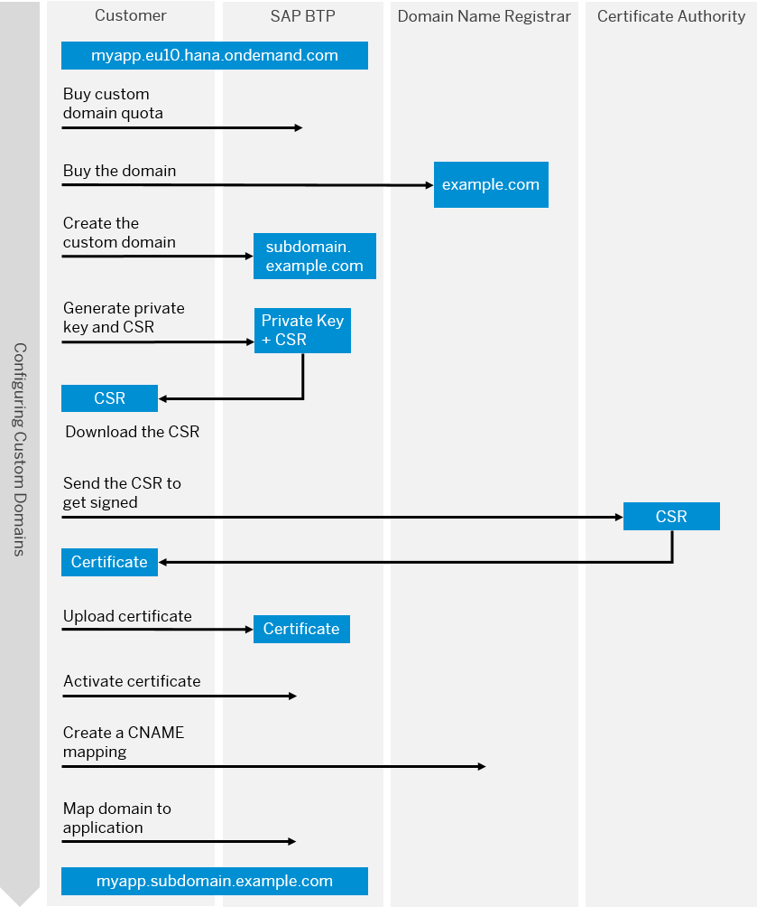

<!-- loio4414cc43db2d4229b27b232a5590e253 -->

<link rel="stylesheet" type="text/css" href="../css/sap-icons.css"/>

# What Is Custom Domain

Configure and expose your application under your own domain. 

The SAP Custom Domain service lets you configure your own custom domain to publicly expose your application, instead of using the default subdomain.

By using this service, subaccount owners can make their SAP BTP applications accessible via a custom domain that is different from the default one \(`hana.ondemand.com`\) - for example, ***www.myshop.com***.

For more information about use cases for Custom Domain, see [SAP Discovery Center](https://discovery-center.cloud.sap/serviceCatalog/custom-domain?service_plan=custom-domain&region=all).

> ### Tip:  
> The English version of this guide is open for contributions and feedback using GitHub. This allows you to get in contact with responsible authors of SAP Help Portal pages and the development team to discuss documentation-related issues. To contribute to this guide, or to provide feedback, choose the corresponding option on SAP Help Portal:
> 
> -   :pencil2:: Contribute to a documentation page. This option opens a pull request on GitHub.
> 
> -    Feedback: Provide feedback about a documentation page. This option opens an issue on GitHub.
> 
> 
> You need a GitHub account to use these options.
> 
> More information:
> 
> -   [Contribution Guidelines](https://help.sap.com/docs/open-documentation-initiative/contribution-guidelines/readme.html)
> 
> -   [Introduction Video](https://www.youtube.com/watch?v=WJ0oarMlVW4)

<a name="loio4414cc43db2d4229b27b232a5590e253__section_fmq_b34_wsb"/>

## Features

  Access to your domain 
 :   Configure your application with a name that is easily recognizable by your customers.

   Application identity protection 
 :   Upload a TLS/SSL certificate to help secure your application identity and the data transmitted between the browser and your application.

 

## Environment

This service runs in the following environments:

-   Cloud Foundry environment
-   Neo environment \(for information about the service in the Neo environment refer to the [Neo documentation](https://help.sap.com/viewer/ea72206b834e4ace9cd834feed6c0e09/Cloud/en-US/98e655aacd1d4fc6a6ab23475b1afcd9.html "SAP Custom Domain service allows subaccount owners to make their SAP BTP applications accessible via a custom domain that is different from the default one (hana.ondemand.com) - for example www.myshop.com.") :arrow_upper_right:\).

## Overview Graphic

The following graphic illustrates the process of obtaining a custom domain certificate.

## Use Cases

Use the Custom Domain service if you want to securely expose your own developed application or a SaaS application under a different domain than the default one.

## Prerequisites

To learn more about the prerequisites, please have a look at the following sections.

-   [Initial Setup](initial-setup-108177a.md)

-   [Prerequisites](prerequisites-48cdbe7.md)

## Tools

You need the Cloud Foundry CLI and the Custom Domain CLI plugin to use the Custom Domain service. For more information, see [Custom Domain Plugin for the Cloud Foundry Environment](https://help.sap.com/viewer/65de2977205c403bbc107264b8eccf4b/Cloud/en-US/1832fcd1eec9415694de50f620e5a522.html "The Custom Domain CLI plugin provides functions for creating private keys and certificate signing requests, as well as additional commands for managing your custom domains.") :arrow_upper_right:. Always keep the Custom Domain CLI plugin up to date.

> ### Tip:  
> Instead of the Command Line Interface \(CLI\), use the Custom Domain Manager User Interface \(UI\) to take advantage of the features provided by its different wizards; for example, for creating new TLS configurations that can be used for one or multiple server certificate activations. For more information, see [Custom Domain Manager](https://help.sap.com/docs/CUSTOM_DOMAINS/6f35a23466ee4df0b19085c9c52f9c29/4f4c3ff62fd2413089dce8a973620167.html?version=Cloud).

## Restrictions

You won't receive a warning from the SAP BTP or the Custom Domain service if one of your certificates is about to expire. To make sure, that a secure connection to your applications is maintained, use a certificate life cycle management tool to monitor your certificates.

