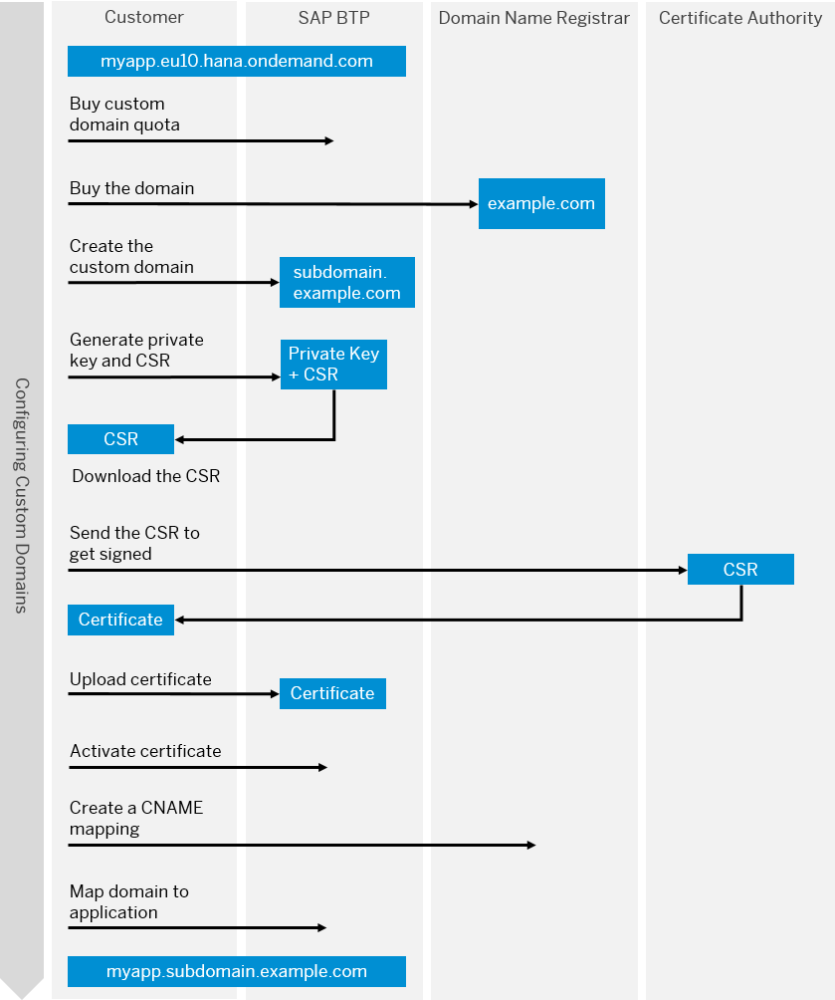

<!-- loioafeb1e77fc2f4365803049e9407449eb -->

# Creating Custom Domains with TLS/SSL Server Authentication

Using custom domains with server authentication lets you establish secure communication between clients and your application.

<a name="loioafeb1e77fc2f4365803049e9407449eb__prereq_etg_52f_2gb"/>

## Prerequisites

There are several prerequisites for creating custom domains. See [Prerequisites](../10-Initial/prerequisites-48cdbe7.md) for additional information.

<a name="loioafeb1e77fc2f4365803049e9407449eb__context_mlp_gj2_3hb"/>

## Context

The whole custom domain configuration process is as follows:

## Procedure

1.  [Create Custom Domains](create-custom-domains-2ab0040.md)

2.  [Create a Certificate Signing Request](create-a-certificate-signing-request-ce1c42b.md)

3.  [Upload and Activate the Signed Certificate](upload-and-activate-the-signed-certificate-908a691.md)

4.  [Configure the DNS for a Custom Domain](configure-the-dns-for-a-custom-domain-da9b54e.md)

5.  [Map Your Own Application to a Custom Domain](map-your-own-application-to-a-custom-domain-d898407.md)

6.  [Test the Custom Domain](test-the-custom-domain-febe99c.md)

**Related Information**  

[Extended Cloud Foundry Commands of Custom Domains](https://help.sap.com/viewer/65de2977205c403bbc107264b8eccf4b/Cloud/en-US/4333dc97ea0d42bd8fe13eebd4382a9b.html "The Custom Domain plugin includes commands that you can use to configure and manage your custom domains.") :arrow_upper_right:

[Learn more about roles and permissions in the Cloud Foundry environment](https://docs.cloudfoundry.org/concepts/roles.html#roles)

