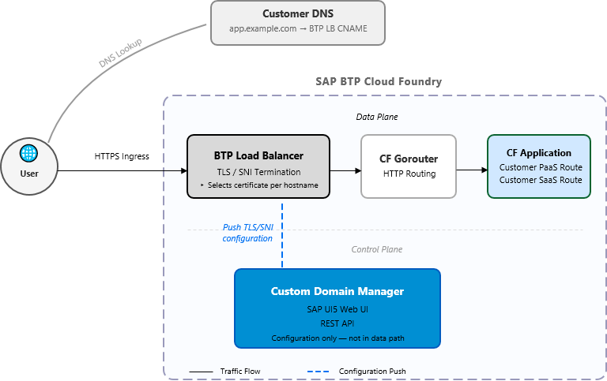

<!-- loio164adf53c5de4e4aa31b59ef87030e00 -->

# High-Level Architecture

Custom domains on SAP BTP Cloud Foundry are managed through the Custom Domain Manager and served exclusively by the BTP Load Balancer. It's important to note that the SAP Custom Domain service itself is not a runtime component—it doesn't handle ingress traffic. All HTTPS traffic for custom domains flows only through the BTP Load Balancer.

<a name="loio164adf53c5de4e4aa31b59ef87030e00__section_xwh_nwc_r2c"/>

## Components

### Custom Domain Manager \(CDM\)

CDM is the administration frontend for custom domain lifecycle management. It provides:

-   *SAP UI5 Web UI* – a browser-based interface for creating, viewing, and managing custom domain configurations.

-   *REST API* – a programmatic interface that supports automation and integration with CI/CD pipelines.

CDM is responsible for orchestrating domain and certificate configuration. It pushes the resulting TLS/SNI configuration to the BTP Load Balancer. CDM is DNS agnostic—DNS is fully the responsibility of the customer.

### BTP Load Balancer

The BTP Load Balancer is the runtime component that actually serves custom domains. It performs the following:

-   Terminates TLS connections using Server Name Indication \(SNI\) to select the correct certificate for each custom domain.

-   Routes incoming HTTPS requests to the appropriate Cloud Foundry application backend.

-   Exists as the only component in the data path—all ingress traffic flows exclusively through the BTP Load Balancer.

### What a Custom Domain Is

A custom domain, is at its core, a TLS SNI configuration on the BTP Load Balancer. It consists of:

-   A DNS hostname \(for example, `app.example.com`\).

-   A TLS certificate and private key bound to that hostname.

-   A routing rule that maps the hostname to a Cloud Foundry application route.

## Traffic Flow

## Key Architectural Principle

The Custom Domain service is not in the data path. CDM manages only the configuration. Once a TLS/SNI configuration is pushed to the BTP Load Balancer, all ingress traffic is entirely handled by the load balancer. CDM is not contacted during the processing of the request.

**Security Events Written in Audit Logs**

<table>
<tr>
<th valign="top">

Concern

</th>
<th valign="top">

Component

</th>
</tr>
<tr>
<td valign="top">

Domain and certificate management

</td>
<td valign="top">

Custom Domain Manager

</td>
</tr>
<tr>
<td valign="top">

TLS termination \(SNI\)

</td>
<td valign="top">

BTP Load Balancer

</td>
</tr>
<tr>
<td valign="top">

HTTP routing

</td>
<td valign="top">

CF Gorouter

</td>
</tr>
<tr>
<td valign="top">

Request processing

</td>
<td valign="top">

CF Application

</td>
</tr>
<tr>
<td valign="top">

Ingress traffic handling

</td>
<td valign="top">

BTP Load Balancer *only* 

</td>
</tr>
</table>

