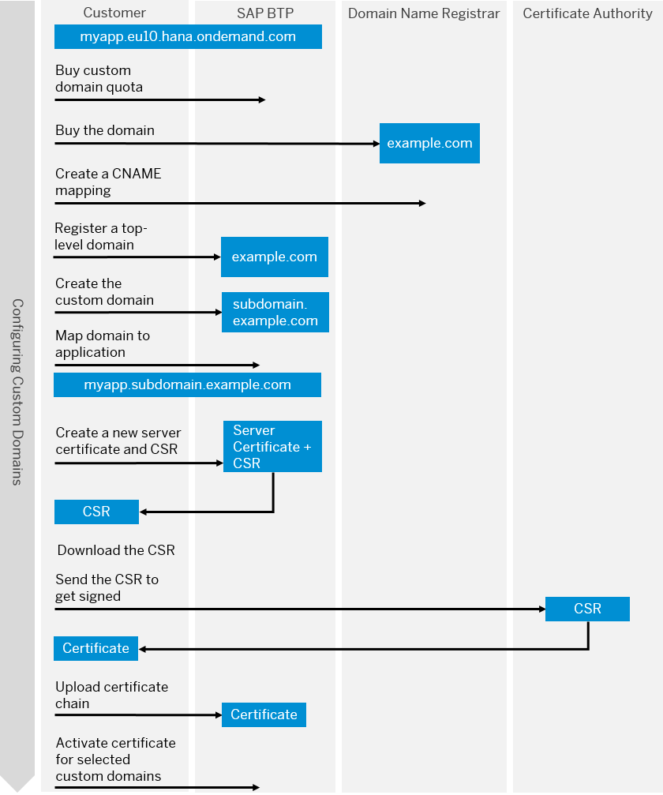

<!-- loio4f4c3ff62fd2413089dce8a973620167 -->

# What Is Custom Domain?

Configure and expose your application under your own domain. 

The SAP Custom Domain service lets you configure your own custom domain to publicly expose your application, instead of using the default subdomain.

By using this service, subaccount owners can make their SAP BTP applications accessible via a custom domain that is different from the default one \(`hana.ondemand.com`\) - for example, ***www.myshop.com***.

For more information about use cases for Custom Domain, see [SAP Discovery Center](https://discovery-center.cloud.sap/serviceCatalog/custom-domain?service_plan=custom-domain&region=all).

<a name="loio4f4c3ff62fd2413089dce8a973620167__section_fmq_b34_wsb"/>

## Features

  Access to your domain 
 :   Configure your application with a name that is easily recognizeable by your customers.

   Application identity protection 
 :   Upload a TLS/SSL certificate to help secure your application identity and the data transmitted between the browser and your application.

 

<a name="loio4f4c3ff62fd2413089dce8a973620167__section_qt3_hst_mpb"/>

## Environment

This service runs in the following environments:

-   Cloud Foundry environment
-   Neo environment \(for information about the service in the Neo environment refer to the [Neo documentation](https://help.sap.com/viewer/ea72206b834e4ace9cd834feed6c0e09/Dev/en-US/98e655aacd1d4fc6a6ab23475b1afcd9.html "SAP Custom Domain service allows subaccount owners to make their SAP BTP applications accessible via a custom domain that is different from the default one (hana.ondemand.com) - for example www.myshop.com.") :arrow_upper_right:\).

<a name="loio4f4c3ff62fd2413089dce8a973620167__section_st3_hst_mpb"/>

## Overview Graphic

The following graphic illustrates the process of obtaining a custom domain certificate.

  

> ### Note:  
> Certificates expire and need to be replaced on time. Therefore, in the process depicted in the overview graphic, the steps of creating a new server certificate and CSR, downloading and getting it signed, and then uploading the certificate chain and activating the selected custom domain certificates, are repeated in a loop as required.

<a name="loio4f4c3ff62fd2413089dce8a973620167__section_tt3_hst_mpb"/>

## Use Cases

Use the Custom Domain service in the following scenarios.

-   You are a PaaS user using different capabilities of the SAP BTP to develop and enrich your applications and want to use a custom domain to securely expose your own developed applications.

-   You are a SaaS user who wants to use a different domain than the default one for a subscribed service.

<a name="loio4f4c3ff62fd2413089dce8a973620167__section_ut3_hst_mpb"/>

## Prerequisites

To learn more about the prerequisites, please have a look at the following sections.

-   [Initial Setup](https://help.sap.com/viewer/74af813c7ee2457cb5eddca0cc70a0c1/Dev/en-US/108177aea2a04d1b9006d96173bfa99a.html "This section provides information on the initial setup of the Custom Domain service in the Cloud Foundry environment.") :arrow_upper_right:

-   [Prerequisites](https://help.sap.com/viewer/74af813c7ee2457cb5eddca0cc70a0c1/Dev/en-US/48cdbe7a64f3475586dc2f4d11c5603c.html "Before configuring custom domains, you have to make some preliminary steps and fulfill a number of prerequisites.") :arrow_upper_right:

<a name="loio4f4c3ff62fd2413089dce8a973620167__section_wt3_hst_mpb"/>

## Restrictions

You won't receive a warning from the SAP BTP or the Custom Domain service if one of your certificates is about to expire. To make sure, that a secure connection to your applications is maintained, use a certificate life cycle management tool to monitor your certificates.

