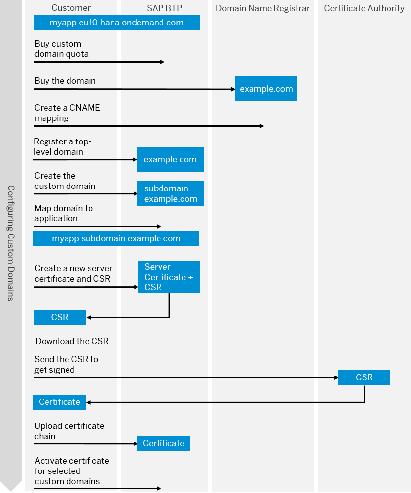

<!-- loiofa4e0f0350bd420bae0866ee5db56ec8 -->

# Create Custom Domains with TLS/SSL Server Authentication

Using custom domains with server authentication lets you establish secure communication between clients and your application.

<a name="loiofa4e0f0350bd420bae0866ee5db56ec8__prereq_etg_52f_2gb"/>

## Prerequisites

There are several prerequisites for creating custom domains. See [Prerequisites](https://help.sap.com/viewer/74af813c7ee2457cb5eddca0cc70a0c1/Dev/en-US/48cdbe7a64f3475586dc2f4d11c5603c.html "Before configuring custom domains, you have to make some preliminary steps and fulfill a number of prerequisites.") :arrow_upper_right: for additional information.

<a name="loiofa4e0f0350bd420bae0866ee5db56ec8__context_mlp_gj2_3hb"/>

## Context

The whole custom domain configuration process is as follows:

<a name="loiofa4e0f0350bd420bae0866ee5db56ec8__steps_ofw_tmr_4pb"/>

## Procedure

1.  [Create Custom Domains with TLS/SSL Server Authentication](create-custom-domains-with-tls-ssl-server-authentication-fa4e0f0.md)

    1.  [Configure the DNS for a Custom Domain](configure-the-dns-for-a-custom-domain-ec2903f.md)

2.  [Manage Reserved and Custom Domains](manage-reserved-and-custom-domains-25ec7ea.md)

3.  [Manage SaaS Routes](manage-saas-routes-7ad1e85.md)

4.  [Manage TLS Configurations](manage-tls-configurations-e696d45.md)

5.  [Manage Server Certificates](manage-server-certificates-1c4cbe6.md)

6.  [Test the Custom Domain](test-the-custom-domain-bbeaa2d.md)

**Related Information**  

[Learn more about roles and permissions in the Cloud Foundry environment](https://docs.cloudfoundry.org/concepts/roles.html#roles)

